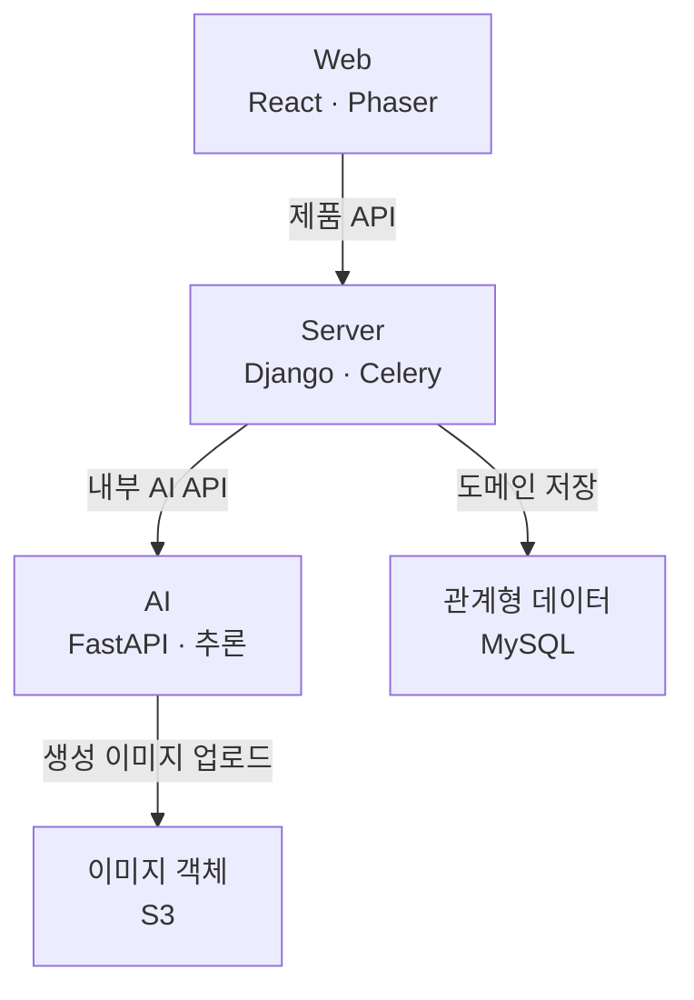
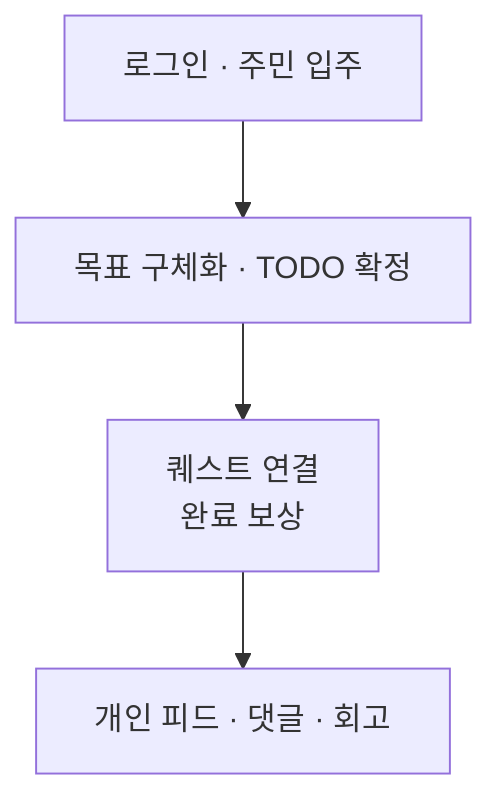

# 몽글마을 Server

> 사용자·TODO·퀘스트·피드를 연결하고 AI 생성 작업을 안정적으로 관리하는 Django 백엔드

[](https://www.python.org/)
[](https://www.djangoproject.com/)
[](https://www.mysql.com/)
[](https://github.com/bigmooon/mongle-server/actions/workflows/ci.yml)

## 프로젝트 개요

**내일도와줘, 몽글마을**은 꾸준한 기록과 루틴 관리를 원하는 사용자를 위해, **자기관리 기능과 애착 인형 기반의 정서적 연결을 결합한 서비스**입니다. 20~30대 여성을 핵심 기획 대상으로 삼아 생산성 앱과 성인 키덜트 시장이 만나는 틈새를 겨냥했습니다. 나의 애착 인형을 픽셀 마을의 AI 주민으로 만들고, 자연어로 이야기한 목표를 실행할 TODO로 구체화합니다.

사용자는 계획을 확인하고 저장한 뒤, 자신의 할 일과 연결된 주민의 퀘스트를 함께 수행합니다. 퀘스트와 연결된 TODO를 완료하면 사과 토큰을 받고, 주민의 이미지·글이 담긴 개인 피드가 생성됩니다. 여기에 캘린더, 집중을 돕는 포모도로, 하루를 돌아보는 회고를 더해 **계획 → 실천 → 성취 기록**을 하나의 마을에서 경험하도록 구성했습니다.

몽글마을은 나만의 캐릭터와 작은 실천을 쌓으며 다시 찾아오고 싶은 자기관리 경험을 목표로 합니다. 대상 사용자와 제품의 출발점은 [프로젝트 기획서의 「핵심 목표·주요 고객」](https://drive.google.com/file/d/1AT0YGK2BfbWJpBcsvgHfugAlRHEdQTak/view)에 정리되어 있습니다.

Server는 이 경험이 사용자별 기록으로 남도록 인증, TODO·일정, 퀘스트, 보상, 피드와 회고 데이터를 관리합니다. Web의 요청을 AI 서비스와 연결하고, 캐릭터·피드·답글 생성은 Celery 작업으로 실행합니다. 계획·퀘스트 생성은 각 API의 제출·조회 방식에 맞춰 처리하며, 저장과 보상 지급은 Django가 담당합니다.

| 영역 | 저장소 | 역할 |
| --- | --- | --- |
| Web | [mongle-web](https://github.com/bigmooon/mongle-web) | React UI와 Phaser 마을 화면 |
| Server | **현재 저장소** | 인증·도메인 API·비동기 작업 관리 |
| AI | [mongle-ai](https://github.com/bigmooon/mongle-ai) | LLM/VLM 에이전트와 추론 API |

## 문제 정의와 리서치 근거

### 1. 계획을 세우는 데서, 기록과 루틴을 이어가는 수요로

자기관리는 일상적인 관심사가 되었습니다. 잡플래닛이 2024년 발표한 설문에서는 **직장인 응답자의 71.2%, 약 10명 중 7명**이 자기개발을 하고 있다고 답했습니다. 전체 응답자는 직장인·휴직/구직자·대학생 등 323명이며, 직장인 수치는 그중 직장인 그룹의 응답입니다. [잡플래닛 조사](https://www.jobplanet.co.kr/contents/news-6416)

기획 발표 자료에서는 Better, Notein, To-Do List, 마이루틴 등 기록·루틴 앱을 최근 1년 성장률 상위 사례로 제시했습니다. 팀은 이 흐름에서 **사용자가 계획을 작성하는 기능에 더해, 꾸준히 기록하고 루틴을 관리할 경험을 찾고 있다**는 기회를 읽었습니다. 성장률의 상세 수치와 원자료 확인 범위는 [시장조사 출처 기록](docs/MARKET_RESEARCH.md)에 정리했습니다.

### 2. 핵심 기획 대상: 자기관리에 관심 있는 20~30대 여성

코리안클릭의 2023.05~2024.04 자료를 인용한 보도에서 스케줄 관리 앱 이용자는 **여성 55.8%**, 연령별로는 **30대 27.7%·20대 27.3%**였습니다. 팀은 여성 이용자가 더 많고 20~30대가 합계 55.0%를 차지한다는 점에 주목해, 기록과 루틴 관리에 관심 있는 **20~30대 여성을 핵심 기획 대상**으로 삼았습니다. 성별·연령별 비율은 각각의 분포이며, ‘20~30대 여성의 비율이 55.0%’라는 뜻은 아닙니다. [이용자 구성 조사](https://www.banronbodo.com/news/articleView.html?idxno=22900)

### 3. 수요는 있지만, 꾸준히 돌아오기는 어렵다

높은 관심이 지속적인 사용을 보장하지는 않습니다. OneSignal의 **2024년 생산성 앱 벤치마크**에서는 1일 리텐션이 **32.86%**, 30일 리텐션이 **9.63%**였습니다. 몽글마을은 이 간극을 ‘계획을 세우게 하는 것만으로는 작심삼일을 넘기 어렵다’는 문제로 받아들였습니다. [OneSignal 벤치마크](https://onesignal.com/mobile-app-benchmarks-2024)

팀은 특히 **완료 경험이 체크 표시에서 끝나면 → 서비스에 정서적 애착을 쌓기 어렵고 → 다시 방문해 루틴을 이어갈 동기가 약해질 수 있다**고 보았습니다. 이는 리텐션 통계에서 직접 입증된 원인이 아니라, 몽글마을이 제품으로 검증하려는 문제 가설입니다. 그래서 ‘할 일을 잘 관리하는가’와 함께 ‘이 공간에 다시 오고 싶은가’를 설계 기준으로 삼았습니다.


### 4. 경쟁 서비스를 세 가지 접근으로 비교

기획 과정에서는 비교 대상을 **일정 관리·개인화·게이미피케이션**으로 나눴습니다. 아래 구분은 발표 자료의 비교 관점이며, 각 서비스의 전체 기능을 배타적으로 분류하거나 성능 순위를 매긴 것은 아닙니다.

| 접근 | 비교한 서비스 | 팀이 주목한 경험 |
| --- | --- | --- |
| 일정 관리 | Todoist · TickTick · Microsoft To Do | 할 일, 마감일, 반복 일정을 체크리스트로 관리 |
| 개인화 | Notion | 문서·데이터베이스·일정 화면을 자신에게 맞게 구성 |
| 게이미피케이션 | Habitica · gogh · Cram & Conquer | 아바타·공간·퀘스트·보상으로 목표 수행에 재미를 부여 |

이 비교에서 몽글마을이 찾은 기회는 **자기관리 기능의 실용성과 캐릭터에 대한 개인적인 애착을 함께 강화하는 것**이었습니다. 게임형 보상에 더해, 사용자가 이미 아끼는 인형을 주민으로 만들면 서비스 밖의 애착을 일상 관리 경험으로 이어올 수 있다고 보았습니다. 비교 기준은 [시장조사 출처 기록](docs/MARKET_RESEARCH.md), 애착 인형과 성인 캐릭터 소비에 대한 기획 배경은 [프로젝트 기획서 1.4절·3절](https://drive.google.com/file/d/1AT0YGK2BfbWJpBcsvgHfugAlRHEdQTak/view)에 정리되어 있습니다.

### 5. 생산성 앱과 성인 키덜트 시장 사이에 자리 잡기

몽글마을은 **생산성 앱의 자기관리 수요**와 **성인 키덜트 시장의 캐릭터·애착 사물 소비**가 만나는 틈새를 겨냥했습니다. 포지셔닝의 두 축은 ‘자기관리 기능’과 ‘정서적 연결’이며, 두 요소를 함께 강화하는 것이 목표입니다.


*발표 자료의 상대적 배치를 재구성한 기획 포지셔닝입니다. 좌표는 측정 점수가 아니며, 몽글마을의 위치는 달성한 성과가 아닌 제품이 지향하는 위치입니다.*

이를 제품에 옮긴 것이 **자연어 목표 → TODO·일정 관리 → 주민 퀘스트 → 완료 보상·주민 피드**입니다. 계획과 기록은 자기관리의 기반을 만들고, 나의 애착 인형으로 만든 주민과 그 주민의 활동 기록은 정서적 연결을 쌓도록 설계했습니다. 몽글마을은 이 둘을 결합해 **할 일을 끝내는 경험이, 내일도 다시 찾아올 이유로 이어지는 자기관리 서비스**를 만들고자 합니다. 실제 효과는 TODO 완료율, 1·7·30일 재방문율, 회고 참여율 등으로 검증할 과제입니다.

화면 구성은 [화면 설계서](https://drive.google.com/file/d/1YtJOZGWTRox2bAD4ejiBRfHChII9syMF/view), 사용 장면은 [시나리오 설계서](https://drive.google.com/file/d/1iEBtXu_PdO8v77O-_BnPvVMfbw2PgwJB/view), 기획과 현재 코드의 차이는 [설계·구현 대조 기록](docs/CROSS_REPOSITORY_REVIEW.md)에서 확인할 수 있습니다.

<details>
<summary>추가 리서치와 저장소별 설계 반영</summary>

기존 기획에서 참고한 시작의 부담과 루틴 앱 수요도 함께 반영했습니다. 아래 수치는 서로 다른 외부 조사에서 인용했으며, 출처 목록은 [프로젝트 기획서](https://drive.google.com/file/d/1AT0YGK2BfbWJpBcsvgHfugAlRHEdQTak/view)에서 확인할 수 있습니다.

| 관찰한 문제 | 조사 결과 | Server 설계에 반영한 방식 |
| --- | --- | --- |
| 시작 자체가 어렵다 | 귀찮음 **25.8%**, 무엇을 할지 모름 **24.4%**, 시간 부족 **21.7%** | 자연어 계획을 TODO·일정으로 저장하는 도메인 API 구성 |
| 생산성 앱을 오래 쓰기 어렵다 | 생산성 앱 리텐션: 1일 **32.86% → 30일 9.63%** | 퀘스트·피드·알림·회고 데이터를 하나의 실행 루프로 연결 |
| AI 생성은 일반 요청보다 오래 걸린다 | 캐릭터·계획·이미지 생성에 외부 모델 호출 필요 | 캐릭터는 Celery·Redis와 DB job, TODO·퀘스트는 AI Submit/Poll 중계 적용 |

</details>

## 시스템 구조

Server는 인증과 사용자 데이터, DB에 기록하는 작업 상태를 관리하며 작업 유형에 맞게 AI API를 호출합니다.



Web의 AI 기능 요청은 Django를 거쳐 FastAPI로 전달됩니다. 원본 사진은 Django가 발급한 presigned URL로 Web이 S3에 직접 PUT하며, Django는 이미지 키·메타데이터와 캐릭터 생성 감사 JSON을 관리합니다. AI가 결과를 HTTP 응답/폴링 결과로 반환하면 Django가 도메인 DB에 반영합니다. S3는 Web 정적 파일 배포와 사용자 미디어 저장에 각각 사용합니다.

Redis는 Server의 Celery broker/result 및 인증 캐시이고, AI job·플래너 대화는 별도 메모리 상태입니다. 제품 DB는 MySQL을 사용하도록 구성되어 있고, Django 기본 설정에서는 `DATABASE_URL`을 지정하지 않으면 SQLite를 사용합니다. [설정 근거](https://github.com/bigmooon/mongle-server/blob/11f428734960dab8db60bc5bc7128fb62e8a495d/config/settings/base.py).

관련 코드: [src/shared/api/client.ts](https://github.com/bigmooon/mongle-web/blob/fcd2734b386035fca2d10980a1bb55ec8e90c4ba/src/shared/api/client.ts) · [src/features/character/api.ts](https://github.com/bigmooon/mongle-web/blob/fcd2734b386035fca2d10980a1bb55ec8e90c4ba/src/features/character/api.ts) · [apps/characters/tasks.py](https://github.com/bigmooon/mongle-server/blob/11f428734960dab8db60bc5bc7128fb62e8a495d/apps/characters/tasks.py) · [infrastructure/storage/s3.py](https://github.com/bigmooon/mongle-server/blob/11f428734960dab8db60bc5bc7128fb62e8a495d/infrastructure/storage/s3.py) · [api/deps.py](https://github.com/bigmooon/mongle-ai/blob/8f897687560a6ebf179e3a0894a3bfd05b778efc/api/deps.py)

### 작업별 통신 방식

| 작업 | Web → Django | Django → AI | 실행·상태 책임 |
| --- | --- | --- | --- |
| 캐릭터 | `POST /characters/generation-jobs/` → 202; `GET /characters/generation-jobs/{id}/` | Celery가 `POST /v1/character` → 202 후 `GET /v1/character/{id}` 폴링 | Django `CharacterGenerationJob` DB 상태 + AI 메모리 job. 성공 후 사용자의 `POST /characters/`로 입주 |
| 단일 TODO 후보 | `POST /todos/generate/`의 최종 응답 대기 | Django 요청 안에서 `POST /v1/todo/generate` 및 `GET /v1/todo/generate/{id}` | Celery 없음. Web에 job ID를 노출하는 방식이 아님 |
| 멀티턴 플래너 | `POST /todos/chat/` → 202; `GET /todos/chat/{id}/` 폴링 | Django가 `/v1/todo/chat` 제출·조회 중계 | AI 메모리 job·플래너 체크포인트. Django DB job 없음 |
| 퀘스트 | 미리보기·확정 API의 최종 응답 대기 | Django 요청 안에서 `/v1/quest/generate` 제출·조회 | Celery 없음. 결과의 유효한 매핑을 Django가 저장 |
| 피드·답글 | TODO 완료·댓글 등록 후 게시물 재조회 | Celery가 `POST /v1/feed/generate`, `/v1/reply/generate` 결과 대기 | Web 관점 백그라운드, AI API 관점 단일 요청/응답. 별도 feed job 조회 API 없음 |

Web → Django 경로에는 `/api/v1`을 앞에 붙입니다. 캐릭터의 Server job ID와 AI job ID는 서로 다르며, 플래너는 AI job ID를 중계합니다. **Submit/Poll이 곧 Celery 사용이나 영속 복구를 뜻하지는 않습니다.**

관련 코드: [apps/todos/views.py](https://github.com/bigmooon/mongle-server/blob/11f428734960dab8db60bc5bc7128fb62e8a495d/apps/todos/views.py) · [apps/todos/ai_client.py](https://github.com/bigmooon/mongle-server/blob/11f428734960dab8db60bc5bc7128fb62e8a495d/apps/todos/ai_client.py) · [apps/characters/tasks.py](https://github.com/bigmooon/mongle-server/blob/11f428734960dab8db60bc5bc7128fb62e8a495d/apps/characters/tasks.py) · [apps/posts/tasks.py](https://github.com/bigmooon/mongle-server/blob/11f428734960dab8db60bc5bc7128fb62e8a495d/apps/posts/tasks.py) · [api/todo_creation/router.py](https://github.com/bigmooon/mongle-ai/blob/8f897687560a6ebf179e3a0894a3bfd05b778efc/api/todo_creation/router.py) · [api/quest_generation/router.py](https://github.com/bigmooon/mongle-ai/blob/8f897687560a6ebf179e3a0894a3bfd05b778efc/api/quest_generation/router.py)


## 문서 기준과 변경 이력

README는 2026-10-10에 확인한 코드와 환경 변수 예시, Compose, CI 설정을 기준으로 작성했습니다. 코드 링크는 당시 커밋을 가리킵니다. Drive 설계 자료와 달라진 부분, 확인이 필요한 항목과 검증 내역은 [교차검증 기록](docs/CROSS_REPOSITORY_REVIEW.md)에서 확인할 수 있습니다.

## 관련 설계 문서

| 문서 | 확인할 수 있는 내용 |
| --- | --- |
| [프로젝트 기획서](https://drive.google.com/file/d/1AT0YGK2BfbWJpBcsvgHfugAlRHEdQTak/view) | 문제 정의, 시장·사용자 리서치와 제품 가설 |
| [시스템 아키텍처](https://drive.google.com/file/d/15p49ZUIrJCmrSCy3LpU3FbjapZaMXdRc/view) | Web·Server·AI 간 구성과 배포 경계 |
| [시스템 구성도](https://drive.google.com/file/d/1-M3fjfxeVXiphXsJgJKYBiKmq1vcqFBz/view) | 서비스·인프라 구성 요소와 연결 관계 |
| [DB 설계 문서](https://drive.google.com/file/d/1PevvUKy8Mx8ltC6oueXnY-aVUMJEuqm8/view) | 주요 도메인과 데이터 모델 |
| [시스템 테스트 계획 및 결과](https://drive.google.com/file/d/16Zkb4-XlJT8G2_D4bAImJMAZZeY1ag3w/view) | 통합 검증 범위와 수행 결과 |

[전체 프로젝트 산출물 보기](https://drive.google.com/drive/folders/1Lfv49TDbilo4ivoSIpw4v8RDEnEw9quC)

## 주요 기능

- 이메일 인증, JWT 갱신과 카카오 소셜 로그인
- 캐릭터 생성 요청·상태 조회와 이미지 URL 관리
- TODO, 캘린더 일정, 태그와 회고 CRUD
- TODO 확정 이후 캐릭터 퀘스트 분배
- 피드, 좋아요, 댓글과 캐릭터 자동 답글
- 인앱 알림과 만료 데이터 정리
- Celery/Redis 기반 비동기 작업과 주기 작업
- S3 presigned URL과 운영 배포 구성

## 사용자 흐름



포모도로는 실행 중 독립적으로 사용하는 로컬 타이머입니다. 피드 생성 완료를 기다려야 포모도로·회고를 사용할 수 있는 순차 의존 관계는 없습니다. 아래 Server 경로의 공통 prefix는 `/api/v1`입니다.

| 단계 | Web 담당 | Server API·저장 | AI·경계 및 근거 |
| --- | --- | --- | --- |
| 로그인·세션 복구 | `auth/store.ts`, `auth/api.ts`, `shared/api/client.ts` | `POST /auth/login`, `/auth/token/refresh`; `GET /auth/me/`; Kakao 교환·가입 보완 | AI 미호출<br/>[src/features/auth/store.ts](https://github.com/bigmooon/mongle-web/blob/fcd2734b386035fca2d10980a1bb55ec8e90c4ba/src/features/auth/store.ts) · [apps/users/urls.py](https://github.com/bigmooon/mongle-server/blob/11f428734960dab8db60bc5bc7128fb62e8a495d/apps/users/urls.py) · [apps/users/refresh_token_service.py](https://github.com/bigmooon/mongle-server/blob/11f428734960dab8db60bc5bc7128fb62e8a495d/apps/users/refresh_token_service.py) |
| 사진·AI 주민 생성 | `character/api.ts`, `pendingJob.ts`, `App.tsx` | 원본 presign → S3 PUT → 생성 job 제출·조회 → `POST /characters/` 입주 | `/v1/character` → persona·이미지·외형 결과<br/>[src/features/character/api.ts](https://github.com/bigmooon/mongle-web/blob/fcd2734b386035fca2d10980a1bb55ec8e90c4ba/src/features/character/api.ts) · [apps/characters/views.py](https://github.com/bigmooon/mongle-server/blob/11f428734960dab8db60bc5bc7128fb62e8a495d/apps/characters/views.py) · [api/character_creation/router.py](https://github.com/bigmooon/mongle-ai/blob/8f897687560a6ebf179e3a0894a3bfd05b778efc/api/character_creation/router.py) |
| 자연어 목표·계획 구체화 | `todo/todoApi.ts`, `planner-chat/plannerApi.ts` | `/todos/generate/`, `/todos/chat/` 및 job 조회 | 단일 분해 또는 후속 질문·계획 후보. 생성만으로 DB에 저장하지 않음<br/>[src/features/planner-chat/plannerApi.ts](https://github.com/bigmooon/mongle-web/blob/fcd2734b386035fca2d10980a1bb55ec8e90c4ba/src/features/planner-chat/plannerApi.ts) · [apps/todos/ai_client.py](https://github.com/bigmooon/mongle-server/blob/11f428734960dab8db60bc5bc7128fb62e8a495d/apps/todos/ai_client.py) · [agents/todo_creation/planner/pipeline.py](https://github.com/bigmooon/mongle-ai/blob/8f897687560a6ebf179e3a0894a3bfd05b778efc/agents/todo_creation/planner/pipeline.py) |
| TODO·캘린더·태그 저장 | TODO 확정, 플래너 확정, `calendar/CalendarModal.tsx` | `/todos/confirm/`, `/todos/planner-confirm/`, `/todos/`, `/schedules/`, `/calendar/`, `/tags/` | 계획 확정은 Django가 오늘 후보를 Todo, 다른 날짜 후보를 Schedule로 저장; AI `/commit`은 이 제품 경로에서 호출하지 않음<br/>[apps/todos/views.py](https://github.com/bigmooon/mongle-server/blob/11f428734960dab8db60bc5bc7128fb62e8a495d/apps/todos/views.py) · [apps/todos/schedule_urls.py](https://github.com/bigmooon/mongle-server/blob/11f428734960dab8db60bc5bc7128fb62e8a495d/apps/todos/schedule_urls.py) · [src/features/calendar/CalendarModal.tsx](https://github.com/bigmooon/mongle-web/blob/fcd2734b386035fca2d10980a1bb55ec8e90c4ba/src/features/calendar/CalendarModal.tsx) |
| 캐릭터 퀘스트 배정 | `previewTodoQuests`, TODO·플래너 확정 UI | `/todos/quest-preview/` 또는 확정 중 `_assign_quests_to_todos` | `/v1/quest/generate`; TODO **ID**와 캐릭터 정보로 매핑. TODO 내용은 LLM에 전달하지 않음<br/>[apps/todos/views.py](https://github.com/bigmooon/mongle-server/blob/11f428734960dab8db60bc5bc7128fb62e8a495d/apps/todos/views.py) · [agents/quest_generation/pipeline.py](https://github.com/bigmooon/mongle-ai/blob/8f897687560a6ebf179e3a0894a3bfd05b778efc/agents/quest_generation/pipeline.py) |
| 완료·보상 | `completeTodo`, App/캘린더 상태 갱신 | `PATCH /todos/{id}/complete/` → Todo·Quest 완료, 잔액·거래 기록 → DB commit 후 피드 예약 | 피드 생성은 완료 응답과 분리<br/>[src/features/todo/todoApi.ts](https://github.com/bigmooon/mongle-web/blob/fcd2734b386035fca2d10980a1bb55ec8e90c4ba/src/features/todo/todoApi.ts) · [apps/todos/views.py](https://github.com/bigmooon/mongle-server/blob/11f428734960dab8db60bc5bc7128fb62e8a495d/apps/todos/views.py) |
| AI 이미지·캡션 | 생성된 피드·알림을 조회 | Celery `generate_feed_post` → AI 호출 → Post 저장·알림 생성 | `/v1/feed/generate`: 장면 프롬프트 → 이미지 → S3 → 캡션 → 결과<br/>[apps/posts/tasks.py](https://github.com/bigmooon/mongle-server/blob/11f428734960dab8db60bc5bc7128fb62e8a495d/apps/posts/tasks.py) · [agents/feed_generation/pipeline.py](https://github.com/bigmooon/mongle-ai/blob/8f897687560a6ebf179e3a0894a3bfd05b778efc/agents/feed_generation/pipeline.py) |
| 피드·댓글·답글 | `feed/api.ts`, `FeedModal.tsx`, `PostScreen.tsx` | `/posts/`, `/posts/{id}/comments/`, `/posts/{id}/like/`; 댓글 commit 후 600초 지연 예약 | `/v1/reply/generate` → Reply 저장. 자기 캐릭터의 개인 피드<br/>[src/features/feed/api.ts](https://github.com/bigmooon/mongle-web/blob/fcd2734b386035fca2d10980a1bb55ec8e90c4ba/src/features/feed/api.ts) · [apps/posts/views.py](https://github.com/bigmooon/mongle-server/blob/11f428734960dab8db60bc5bc7128fb62e8a495d/apps/posts/views.py) · [apps/posts/tasks.py](https://github.com/bigmooon/mongle-server/blob/11f428734960dab8db60bc5bc7128fb62e8a495d/apps/posts/tasks.py) |
| 포모도로 | `pomodoro/PomodoroHud.tsx`: 25분/5분, 종료 시 다음 모드에서 정지 | 서버 API·집중 이력 DB 저장 없음 | AI 미호출; `localStorage`의 종료 시각으로 복원<br/>[src/features/pomodoro/PomodoroHud.tsx](https://github.com/bigmooon/mongle-web/blob/fcd2734b386035fca2d10980a1bb55ec8e90c4ba/src/features/pomodoro/PomodoroHud.tsx) |
| 회고 | `reflection/api.ts`: 당일 문맥·과거 회고 조회, 작성·수정 | `/reflections/context/{date}/`, `/reflections/`, `/{id}/`; Reflection·보상 거래 저장 | AI 미호출<br/>[src/features/reflection/api.ts](https://github.com/bigmooon/mongle-web/blob/fcd2734b386035fca2d10980a1bb55ec8e90c4ba/src/features/reflection/api.ts) · [apps/todos/reflection_views.py](https://github.com/bigmooon/mongle-server/blob/11f428734960dab8db60bc5bc7128fb62e8a495d/apps/todos/reflection_views.py) |

### 인증·영속화 경계

사용자 인증은 Access JWT(기본 1시간)와 **opaque Refresh 토큰**을 함께 사용합니다. Refresh 원문은 HttpOnly 쿠키(`mongle_refresh_token`, `/api/v1/auth`, SameSite=Lax, 운영 Secure)에 넣고 DB에는 SHA-256 해시를 저장합니다. 갱신은 기존 행을 폐기하고 새 토큰으로 회전합니다. 자동 로그인은 2주, 일반 로그인은 3시간 수명을 사용하며 회전 시 갱신됩니다. AI 호출에는 사용자 JWT 대신 서비스 간 `X-API-Key`를 사용합니다.

관련 코드: [apps/users/views.py](https://github.com/bigmooon/mongle-server/blob/11f428734960dab8db60bc5bc7128fb62e8a495d/apps/users/views.py) · [apps/users/refresh_token_service.py](https://github.com/bigmooon/mongle-server/blob/11f428734960dab8db60bc5bc7128fb62e8a495d/apps/users/refresh_token_service.py) · [config/settings/base.py](https://github.com/bigmooon/mongle-server/blob/11f428734960dab8db60bc5bc7128fb62e8a495d/config/settings/base.py) · [api/security.py](https://github.com/bigmooon/mongle-ai/blob/8f897687560a6ebf179e3a0894a3bfd05b778efc/api/security.py)

| 저장소 | 실제 저장 대상·사용 위치 |
| --- | --- |
| MySQL | User·SocialAccount·RefreshToken 해시·TokenTransaction·Notification, SourceImage 메타데이터·CharacterGenerationJob·Character·ImgGenLog, Todo·Schedule·Tag·Quest·Reflection, Post·Comment·Reply. 이미지 바이너리 대신 키/URL 저장 |
| S3 | Web의 원본 `source-images/` 직접 PUT, AI의 `characters/`·`feeds/` 생성 이미지, Server의 `log/character-gen/` 감사 JSON. 공통 `AWS_S3_PREFIX` 사용 |
| Redis | Celery broker/result backend, Django 요청 제한 캐시, 이메일 인증 코드·검증 토큰. 제품 TODO·플래너 대화의 영속 DB가 아님 |
| AI 프로세스 메모리 | 생성 job 결과와 플래너 `MemorySaver`; Django 도메인 DB와 분리 |

관련 코드: [apps/users/models.py](https://github.com/bigmooon/mongle-server/blob/11f428734960dab8db60bc5bc7128fb62e8a495d/apps/users/models.py) · [apps/characters/models.py](https://github.com/bigmooon/mongle-server/blob/11f428734960dab8db60bc5bc7128fb62e8a495d/apps/characters/models.py) · [apps/todos/models.py](https://github.com/bigmooon/mongle-server/blob/11f428734960dab8db60bc5bc7128fb62e8a495d/apps/todos/models.py) · [apps/tags/models.py](https://github.com/bigmooon/mongle-server/blob/11f428734960dab8db60bc5bc7128fb62e8a495d/apps/tags/models.py) · [apps/quests/models.py](https://github.com/bigmooon/mongle-server/blob/11f428734960dab8db60bc5bc7128fb62e8a495d/apps/quests/models.py) · [apps/posts/models.py](https://github.com/bigmooon/mongle-server/blob/11f428734960dab8db60bc5bc7128fb62e8a495d/apps/posts/models.py) · [apps/users/signup_views.py](https://github.com/bigmooon/mongle-server/blob/11f428734960dab8db60bc5bc7128fb62e8a495d/apps/users/signup_views.py) · [apps/users/rate_limit.py](https://github.com/bigmooon/mongle-server/blob/11f428734960dab8db60bc5bc7128fb62e8a495d/apps/users/rate_limit.py) · [agents/todo_creation/planner/graph.py](https://github.com/bigmooon/mongle-ai/blob/8f897687560a6ebf179e3a0894a3bfd05b778efc/agents/todo_creation/planner/graph.py)

### 작업 실패·재시도와 복구 한계

- 캐릭터: DB의 `QUEUED → IN_PROGRESS → SUCCEEDED → CONSUMED`와 `FAILED`를 관리합니다. Celery는 AI를 3초 간격·300초 제한으로 조회합니다. 실패/취소 시 생성 횟수를 환불하고 취소와 결과 저장을 행 잠금으로 조정합니다. `max_retries=3` 선언은 있지만 이 task에 `self.retry()` 호출은 없어 자동 재제출을 보장하지 않습니다.
- TODO·퀘스트: 단일 후보 생성 실패는 502로 알립니다. 퀘스트 호출 실패 시 이미 저장한 TODO는 유지하고 퀘스트를 생략합니다. `/todos/sync-quests/`는 오늘의 미배정 Todo를 처리하는 API지만 현재 Web에서 호출하는 경로는 확인되지 않습니다. Schedule의 자동 Todo 전환 경로도 확인되지 않으므로 자동 복구로 기술하지 않습니다.
- 피드·답글: HTTP 호출 실패는 30초 후 최대 2회 재시도합니다. 빈 결과는 로그 후 종료합니다. 완료·댓글 DB commit 후 큐 예약이 실패하면 로그만 남기므로, 보상이나 댓글 저장 성공이 피드·답글 게시 성공까지 보장하지는 않습니다.
- 주기 작업: 미완료 TODO 실패 처리·회고 알림·이미지 횟수 정리·Refresh 정리 스케줄이 있습니다. 로컬/운영 Compose에는 Beat 서비스가 없으므로 별도 Beat 실행 없이는 스케줄 설정만으로 작동하지 않습니다.
- AI 재시작 시 메모리 job은 사라집니다. 캐릭터 DB job과 브라우저 pending 값이 남아 있어도 원격 추론을 재개하는 것은 아닙니다. Redis Compose에도 영속 볼륨/AOF 설정이 없어 재생성 시 큐 보존을 전제할 수 없습니다.

관련 코드: [apps/characters/tasks.py](https://github.com/bigmooon/mongle-server/blob/11f428734960dab8db60bc5bc7128fb62e8a495d/apps/characters/tasks.py) · [apps/characters/views.py](https://github.com/bigmooon/mongle-server/blob/11f428734960dab8db60bc5bc7128fb62e8a495d/apps/characters/views.py) · [apps/todos/views.py](https://github.com/bigmooon/mongle-server/blob/11f428734960dab8db60bc5bc7128fb62e8a495d/apps/todos/views.py) · [apps/posts/tasks.py](https://github.com/bigmooon/mongle-server/blob/11f428734960dab8db60bc5bc7128fb62e8a495d/apps/posts/tasks.py) · [apps/posts/views.py](https://github.com/bigmooon/mongle-server/blob/11f428734960dab8db60bc5bc7128fb62e8a495d/apps/posts/views.py) · [config/settings/base.py](https://github.com/bigmooon/mongle-server/blob/11f428734960dab8db60bc5bc7128fb62e8a495d/config/settings/base.py) · [docker-compose.yml](https://github.com/bigmooon/mongle-server/blob/11f428734960dab8db60bc5bc7128fb62e8a495d/docker-compose.yml) · [docker-compose.prod.yml](https://github.com/bigmooon/mongle-server/blob/11f428734960dab8db60bc5bc7128fb62e8a495d/docker-compose.prod.yml) · [api/character_creation/jobs.py](https://github.com/bigmooon/mongle-ai/blob/8f897687560a6ebf179e3a0894a3bfd05b778efc/api/character_creation/jobs.py)

## 담당한 부분

도메인 API부터 AI 연동과 운영 배포까지 백엔드의 핵심 흐름을 구현했습니다. 아래 항목은 병합된 PR로 확인할 수 있습니다.

- **프로젝트 기반**: Django 구조와 개발 환경을 구성했습니다. ([#2](https://github.com/mong-studio/mongle-server/pull/2))
- **인증**: 로그인·Refresh 흐름과 카카오 로그인을 구현했습니다. ([#13](https://github.com/mong-studio/mongle-server/pull/13), [#67](https://github.com/mong-studio/mongle-server/pull/67))
- **TODO·태그**: 태그 CRUD와 플래너·캘린더 API를 구현했습니다. ([#50](https://github.com/mong-studio/mongle-server/pull/50), [#64](https://github.com/mong-studio/mongle-server/pull/64))
- **비동기 AI 연동**: 캐릭터·TODO·퀘스트 요청을 Submit/Poll 구조로 연결했습니다. ([#39](https://github.com/mong-studio/mongle-server/pull/39), [#47](https://github.com/mong-studio/mongle-server/pull/47), [#68](https://github.com/mong-studio/mongle-server/pull/68))
- **운영 환경**: Celery 서비스, Nginx/TLS와 배포 설정을 안정화했습니다. ([#57](https://github.com/mong-studio/mongle-server/pull/57), [#65](https://github.com/mong-studio/mongle-server/pull/65), [#66](https://github.com/mong-studio/mongle-server/pull/66))
- **미디어·피드 정합성**: S3 presigned URL, 댓글 정책과 삭제 캐릭터의 기존 기록 유지를 처리했습니다. ([#78](https://github.com/mong-studio/mongle-server/pull/78), [#81](https://github.com/mong-studio/mongle-server/pull/81), [#83](https://github.com/mong-studio/mongle-server/pull/83))

## 기술적 선택

| 문제 | 선택 | 이유 |
| --- | --- | --- |
| 모델 추론이 일반 HTTP 요청보다 오래 걸림 | 캐릭터·피드·답글의 Celery + Redis, AI Submit/Poll | 작업 유형별 대기와 상태 조회를 분리하기 위해. 모든 요청의 중복 실행·영속 복구를 보장하지 않음 |
| Web과 AI의 책임 분리 | Django 도메인 계층 + 별도 FastAPI | 인증·영속화와 모델 실행을 독립적으로 배포하기 위해 |
| Refresh token 보안 | HttpOnly 쿠키 기반 갱신 | 브라우저 JavaScript에서 장기 토큰 노출을 줄이기 위해 |
| 사용자 업로드와 생성 이미지 전달 | S3 presigned URL | 서버를 거치지 않고 제한된 시간 동안 파일을 전달하기 위해 |
| 개발·운영 환경 차이 | 분리된 settings + Docker Compose | 테스트와 배포 설정의 의도하지 않은 혼합을 줄이기 위해 |

## 검증 결과

2026-10-10에 기록한 로컬 검증 결과입니다. 이번 README 수정에서는 애플리케이션 테스트를 다시 실행하지 않았습니다.

| 검증 | 결과 |
| --- | ---: |
| pytest | 236 tests passed |
| Branch coverage | 84.16% |
| Ruff lint / format | 통과 |
| mypy | 통과 |

CI workflow는 MySQL 8.4와 Redis 8 서비스를 띄운 뒤 Ruff, Django 검사, mypy, pytest와 80% 커버리지 게이트를 실행하도록 구성되어 있습니다.

## 빠른 시작

### 요구 환경

- Python 3.12
- [uv](https://docs.astral.sh/uv/)
- MySQL·Redis 또는 Docker. CI는 MySQL 8.4/Redis 8, 로컬 Compose는 MySQL 9.7/Redis 7, 운영 Compose는 Redis 7이며 DB는 외부 `DATABASE_URL`을 사용합니다. 환경별 버전이 다르므로 실행하려는 구성의 설정을 확인해야 합니다. ([Compose](docker-compose.yml), [운영 Compose](docker-compose.prod.yml), [CI](.github/workflows/ci.yml))

### 로컬 실행

```bash
git clone https://github.com/bigmooon/mongle-server.git
cd mongle-server
cp .env.example .env
make install-dev
make migrate
make runserver
```

```bash
curl http://localhost:8000/health/
# {"status":"ok"}
```

### Docker 실행

```bash
cp .env.example .env
make docker-up
docker compose exec -T web python manage.py migrate
docker compose exec -T web python manage.py seed_dev
```

상세한 로컬·Docker 설정은 [`docs/setup-guide.md`](docs/setup-guide.md)와 [`docs/local-docker-guide.md`](docs/local-docker-guide.md)에서 확인할 수 있습니다.

### 검증

```bash
make validate
```

`make validate`는 lint, format, test와 typecheck를 실행합니다.

## 주요 API 영역

| Prefix | 기능 |
| --- | --- |
| `/api/v1/auth/` | 이메일·JWT·카카오 인증 |
| `/api/v1/characters/` | 캐릭터와 생성 작업 |
| `/api/v1/todos/` | TODO와 AI 플래너 연동 |
| `/api/v1/tags/` | 사용자 태그 |
| `/api/v1/schedules/`, `/api/v1/calendar/` | 일정 저장·월별 조회 ([라우팅](apps/todos/schedule_urls.py)) |
| `/api/v1/quests/` | 캐릭터 퀘스트 |
| `/api/v1/posts/` | 피드·좋아요·댓글 |
| `/api/v1/reflections/` | 일일 회고 |
| `/api/v1/notifications/` | 인앱 알림 |

## 디렉터리 구조

```text
apps/
├── users/           인증·사용자·알림
├── characters/      AI 캐릭터와 생성 작업
├── todos/           TODO·일정·회고·AI 연동
├── tags/            사용자 태그
├── quests/          캐릭터 퀘스트
└── posts/           피드·좋아요·댓글
common/              공통 코드
config/              URL·Celery·환경별 settings
infrastructure/      외부 시스템 경계
tests/               단위·통합 테스트
docs/                개발·배포 가이드
```

## 배포

| 서비스 | 저장소에 정의된 배포·통신 경로 |
| --- | --- |
| Web | Node 빌드 → S3 정적 배포 → CloudFront invalidation. 개발은 Vite `/api` proxy → `localhost:8000`; 배포는 빌드 시 `VITE_API_BASE` 주입 |
| Server | 테스트 → Docker Hub → AWS OIDC·SSM → EC2 Compose. Nginx TLS → `web:8000` Gunicorn → Django. DB 주소는 `DATABASE_URL`, AI 주소는 아래 두 설정군 사용 |
| AI API | 테스트 → Docker Hub → RunPod CPU Pod 재시작 → `8010/health` 확인. Compose의 단독 API 실행과 GPU 워커는 별도 구성 |
| 추론 워커 | LLM·플래너·이미지 Docker 이미지 빌드. `v*` 태그 workflow에서 RunPod 템플릿 갱신. FastAPI가 RunPod endpoint를 호출하고 결과를 수집 |

Server의 TODO·퀘스트는 `MONGLE_AI_API_BASE`/`MONGLE_AI_API_KEY`, 캐릭터·피드·답글은 `AI_SERVICE_URL`/`AI_SERVICE_TOKEN`을 사용합니다. 두 키는 연결할 AI의 `MONGLE_API_KEY`와 맞춰야 합니다. 컨테이너에서 호스트 AI에 연결할 때 loopback 대신 도달 가능한 호스트 주소를 설정해야 합니다.

배포 경로는 저장소의 Compose와 CI 설정을 기준으로 정리했습니다. 실제 DNS, CloudFront origin, RDS 엔진 버전, RunPod에서 사용 중인 모델과 비밀 환경 변수는 운영 환경에서 별도로 확인해야 합니다. Nginx 대기 제한(120초), Server AI 폴링 기본 예산(150초), Gunicorn 제한(180초)이 달라 동기 대기 경로의 타임아웃 위험도 남아 있습니다.

관련 코드: [.github/workflows/deploy-web.yml](https://github.com/bigmooon/mongle-web/blob/fcd2734b386035fca2d10980a1bb55ec8e90c4ba/.github/workflows/deploy-web.yml) · [vite.config.ts](https://github.com/bigmooon/mongle-web/blob/fcd2734b386035fca2d10980a1bb55ec8e90c4ba/vite.config.ts) · [.github/workflows/deploy-server.yml](https://github.com/bigmooon/mongle-server/blob/11f428734960dab8db60bc5bc7128fb62e8a495d/.github/workflows/deploy-server.yml) · [nginx/api.conf](https://github.com/bigmooon/mongle-server/blob/11f428734960dab8db60bc5bc7128fb62e8a495d/nginx/api.conf) · [Dockerfile](https://github.com/bigmooon/mongle-server/blob/11f428734960dab8db60bc5bc7128fb62e8a495d/Dockerfile) · [.env.example](https://github.com/bigmooon/mongle-server/blob/11f428734960dab8db60bc5bc7128fb62e8a495d/.env.example) · [.github/workflows/deploy-api.yml](https://github.com/bigmooon/mongle-ai/blob/8f897687560a6ebf179e3a0894a3bfd05b778efc/.github/workflows/deploy-api.yml) · [.github/workflows/deploy-workers.yml](https://github.com/bigmooon/mongle-ai/blob/8f897687560a6ebf179e3a0894a3bfd05b778efc/.github/workflows/deploy-workers.yml) · [docker-compose.yml](https://github.com/bigmooon/mongle-ai/blob/8f897687560a6ebf179e3a0894a3bfd05b778efc/docker-compose.yml)

## 한계와 다음 과제

- AI 모델과 S3를 포함한 전체 E2E는 로컬 기본 검증과 별도로 확인해야 합니다.
- JWT 테스트에서 사용하는 짧은 개발용 키는 운영 키와 분리되어 있습니다.
- 생성 작업의 지연 시간, 실패율과 재시도 횟수를 운영 지표로 수집할 필요가 있습니다.
- API 계약과 프론트엔드 사용자 흐름을 연결하는 브라우저 E2E가 필요합니다.
