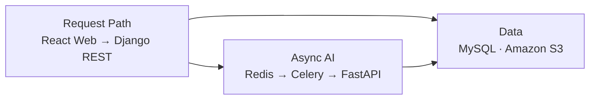

# 몽글마을 Server

> 사용자·TODO·퀘스트·피드를 연결하고 AI 생성 작업을 안정적으로 관리하는 Django 백엔드

[](https://www.python.org/)
[](https://www.djangoproject.com/)
[](https://www.mysql.com/)
[](https://github.com/bigmooon/mongle-server/actions/workflows/ci.yml)

## 프로젝트 개요

몽글마을은 사용자의 애착 인형을 AI 주민으로 만들고, 자연어 목표를 TODO와 캐릭터 퀘스트로 바꾸는 서비스입니다. Server는 제품의 도메인 데이터와 인증을 관리하고, 실행 시간이 긴 AI 요청을 Celery 작업으로 분리해 Web과 AI 서비스를 연결합니다.

| 영역 | 저장소 | 역할 |
| --- | --- | --- |
| Web | [mongle-web](https://github.com/bigmooon/mongle-web) | React UI와 Phaser 마을 화면 |
| Server | **현재 저장소** | 인증·도메인 API·비동기 작업 관리 |
| AI | [mongle-ai](https://github.com/bigmooon/mongle-ai) | LLM/VLM 에이전트와 추론 API |

## 시스템 구조



인증·데이터 정합성은 Django가 담당하고, 모델 추론은 AI 서비스에 위임합니다. 캐릭터와 TODO 생성은 요청 접수와 결과 조회를 분리해 긴 추론 시간에도 Web 요청이 유지되도록 설계했습니다.

## 관련 설계 문서

| 문서 | 확인할 수 있는 내용 |
| --- | --- |
| [시스템 아키텍처](https://drive.google.com/file/d/15p49ZUIrJCmrSCy3LpU3FbjapZaMXdRc/view) | Web·Server·AI 간 구성과 배포 경계 |
| [시스템 구성도](https://drive.google.com/file/d/1-M3fjfxeVXiphXsJgJKYBiKmq1vcqFBz/view) | 서비스·인프라 구성 요소와 연결 관계 |
| [DB 설계 문서](https://drive.google.com/file/d/1PevvUKy8Mx8ltC6oueXnY-aVUMJEuqm8/view) | 주요 도메인과 데이터 모델 |
| [시스템 테스트 계획 및 결과](https://drive.google.com/file/d/16Zkb4-XlJT8G2_D4bAImJMAZZeY1ag3w/view) | 통합 검증 범위와 수행 결과 |

[전체 프로젝트 산출물 보기](https://drive.google.com/drive/folders/1Lfv49TDbilo4ivoSIpw4v8RDEnEw9quC)

## 주요 기능

- 이메일 인증, JWT 갱신과 카카오 소셜 로그인
- 캐릭터 생성 요청·상태 조회와 이미지 URL 관리
- TODO, 캘린더 일정, 태그와 회고 CRUD
- TODO 확정 이후 캐릭터 퀘스트 분배
- 피드, 좋아요, 댓글과 캐릭터 자동 답글
- 인앱 알림과 만료 데이터 정리
- Celery/Redis 기반 비동기 작업과 주기 작업
- S3 presigned URL과 운영 배포 구성

## 담당한 부분

도메인 API부터 AI 연동과 운영 배포까지 백엔드의 핵심 흐름을 구현했습니다. 아래 항목은 병합된 PR로 확인할 수 있습니다.

- **프로젝트 기반**: Django 구조와 개발 환경을 구성했습니다. ([#2](https://github.com/mong-studio/mongle-server/pull/2))
- **인증**: 로그인·Refresh 흐름과 카카오 로그인을 구현했습니다. ([#13](https://github.com/mong-studio/mongle-server/pull/13), [#67](https://github.com/mong-studio/mongle-server/pull/67))
- **TODO·태그**: 태그 CRUD와 플래너·캘린더 API를 구현했습니다. ([#50](https://github.com/mong-studio/mongle-server/pull/50), [#64](https://github.com/mong-studio/mongle-server/pull/64))
- **비동기 AI 연동**: 캐릭터·TODO·퀘스트 요청을 Submit/Poll 구조로 연결했습니다. ([#39](https://github.com/mong-studio/mongle-server/pull/39), [#47](https://github.com/mong-studio/mongle-server/pull/47), [#68](https://github.com/mong-studio/mongle-server/pull/68))
- **운영 환경**: Celery 서비스, Nginx/TLS와 배포 설정을 안정화했습니다. ([#57](https://github.com/mong-studio/mongle-server/pull/57), [#65](https://github.com/mong-studio/mongle-server/pull/65), [#66](https://github.com/mong-studio/mongle-server/pull/66))
- **미디어·피드 정합성**: S3 presigned URL, 댓글 정책과 삭제 캐릭터의 기존 기록 유지를 처리했습니다. ([#78](https://github.com/mong-studio/mongle-server/pull/78), [#81](https://github.com/mong-studio/mongle-server/pull/81), [#83](https://github.com/mong-studio/mongle-server/pull/83))

## 기술적 선택

| 문제 | 선택 | 이유 |
| --- | --- | --- |
| 모델 추론이 일반 HTTP 요청보다 오래 걸림 | Celery + Redis + Submit/Poll | 요청 타임아웃과 중복 작업을 줄이고 상태를 조회할 수 있도록 |
| Web과 AI의 책임 분리 | Django 도메인 계층 + 별도 FastAPI | 인증·영속화와 모델 실행을 독립적으로 배포하기 위해 |
| Refresh token 보안 | HttpOnly 쿠키 기반 갱신 | 브라우저 JavaScript에서 장기 토큰 노출을 줄이기 위해 |
| 사용자 업로드와 생성 이미지 전달 | S3 presigned URL | 서버를 거치지 않고 제한된 시간 동안 파일을 전달하기 위해 |
| 개발·운영 환경 차이 | 분리된 settings + Docker Compose | 테스트와 배포 설정의 의도하지 않은 혼합을 줄이기 위해 |

## 검증 결과

2026-10-10 로컬 환경에서 다음 항목을 확인했습니다.

| 검증 | 결과 |
| --- | ---: |
| pytest | 236 tests passed |
| Branch coverage | 84.16% |
| Ruff lint / format | 통과 |
| mypy | 통과 |

CI workflow는 MySQL 8.4와 Redis 8 서비스를 띄운 뒤 Ruff, Django 검사, mypy, pytest와 80% 커버리지 게이트를 실행하도록 구성되어 있습니다.

## 빠른 시작

### 요구 환경

- Python 3.12
- [uv](https://docs.astral.sh/uv/)
- MySQL 8.4, Redis 8 또는 Docker

### 로컬 실행

```bash
git clone https://github.com/bigmooon/mongle-server.git
cd mongle-server
cp .env.example .env
make install-dev
make migrate
make runserver
```

```bash
curl http://localhost:8000/health/
# {"status":"ok"}
```

### Docker 실행

```bash
cp .env.example .env
make docker-up
docker compose exec -T web python manage.py migrate
docker compose exec -T web python manage.py seed_dev
```

상세한 로컬·Docker 설정은 [`docs/setup-guide.md`](docs/setup-guide.md)와 [`docs/local-docker-guide.md`](docs/local-docker-guide.md)에서 확인할 수 있습니다.

### 검증

```bash
make validate
```

`make validate`는 lint, format, test와 typecheck를 실행합니다.

## 주요 API 영역

| Prefix | 기능 |
| --- | --- |
| `/api/v1/auth/` | 이메일·JWT·카카오 인증 |
| `/api/v1/characters/` | 캐릭터와 생성 작업 |
| `/api/v1/todos/` | TODO와 AI 플래너 연동 |
| `/api/v1/tags/` | 사용자 태그 |
| `/api/v1/quests/` | 캐릭터 퀘스트 |
| `/api/v1/posts/` | 피드·좋아요·댓글 |
| `/api/v1/reflections/` | 일일 회고 |
| `/api/v1/notifications/` | 인앱 알림 |

## 디렉터리 구조

```text
apps/
├── users/           인증·사용자·알림
├── characters/      AI 캐릭터와 생성 작업
├── todos/           TODO·일정·회고·AI 연동
├── tags/            사용자 태그
├── quests/          캐릭터 퀘스트
└── posts/           피드·좋아요·댓글
common/              공통 코드
config/              URL·Celery·환경별 settings
infrastructure/      외부 시스템 경계
tests/               단위·통합 테스트
docs/                개발·배포 가이드
```

## 배포

`main`의 Server 코드가 변경되면 GitHub Actions가 테스트를 통과한 이미지만 Docker Hub에 게시하고 EC2에서 새 컨테이너로 교체합니다. AWS 접근은 GitHub OIDC와 SSM을 사용하도록 구성했습니다.

## 한계와 다음 과제

- AI 모델과 S3를 포함한 전체 E2E는 로컬 기본 검증과 별도로 확인해야 합니다.
- JWT 테스트에서 사용하는 짧은 개발용 키는 운영 키와 분리되어 있습니다.
- 생성 작업의 지연 시간, 실패율과 재시도 횟수를 운영 지표로 수집할 필요가 있습니다.
- API 계약과 프론트엔드 사용자 흐름을 연결하는 브라우저 E2E가 필요합니다.
